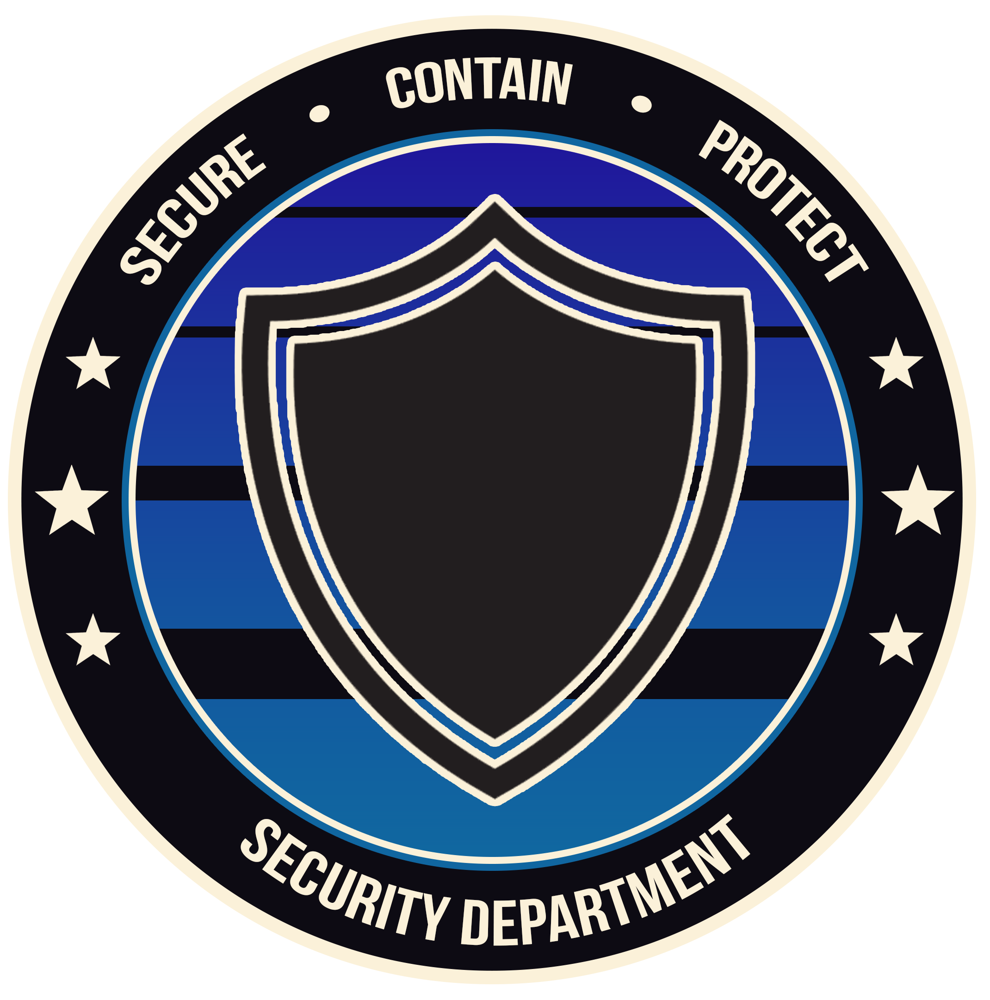

 
  
Security Department  
Personnel Guidelines  

**Classification:** Level 0  
**Special Access Group:** N/A  
**Updated:** 5/4/2022  

  

---

The Security Department is the main combative force within the Foundation, and are the first responders to nearly any incidents that may arise in the facility, whether it be managing the Class-D Containment Zone or watching over Points of Interest. In the end, the Security Department is critical to the success of the Foundation’s operations.

:::info
The Security Department is a **Primary** department.
:::

:::warning
Security Department Documentation will always override detachment documentation unless otherwise clarified by the Security Chief or anyone ranking above.
:::