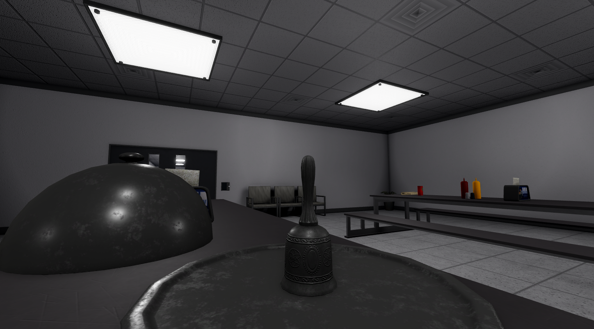

export const Center = ({children}) => (
   <div
      style={{
         "textAlign": "center"
      }}>
      {children}
   </div>
)

export const TextColor = ({children, color}) => (
<span
style={{
      color: color,
    }}>
{children}
</span>
);

<Center></Center>
<Center>SCP-662, an engraved silver bell</Center>

<br />

:::info
Testing Clearance: <TextColor color="#735cff">**Junior Researcher**</TextColor> <br />
Cross-Testing Clearance: <TextColor color="#735cff">**Researcher**</TextColor> <br />
Maximum Class-D Allowed: <TextColor color="#FF6A00">**3**</TextColor> <br />
Location: <TextColor color="#3161c1">**Cleanrooms**</TextColor> <br />
:::


**SCP-662, also known as "Mr. Deeds"**, is a standard silver bell with intricate engravings. As it is made of very pure silver, it requires regular polishing to remain without tarnish.

```
$ SCPF_NETWORK/PARAGON/DATABASE/SCP-662
$ RESULT :: NO CURRENTLY KNOWN INFORMATION
```
