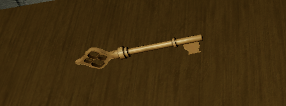

export const Center = ({children}) => (
   

      {children}
   

)

export const TextColor = ({children, color}) => (

{children}

);

SCP-005

 

:::info
Testing Clearance: <TextColor color="#735cff">**Junior Researcher**</TextColor>  
Cross-Testing Clearance: <TextColor color="#735cff">**Junior Researcher**</TextColor>  
Maximum Class-D Allowed: <TextColor color="#FF6A00">**7**</TextColor>  
Location: <TextColor color="#3161c1">**ScD Cleanrooms**</TextColor>  
:::

 

**SCP-005, also known as "Skeleton Key"**, is an antique, ornate key, displaying physical relation to manufactured objects of its like in the 1920s. 

When used, SCP-005 is rumored to be able to open any locked door with the proper mechanism. The anomaly has only been experimented on within the confines of the Cleanrooms sector, and doors restricted to Security Clearance 1 and below. The Scientific Department has yet to use SCP-005 on any doors outside of the Cleanrooms.
:::info
When testing on SCP-005, an accompanying Facility Personnel holding equal or higher Security Clearance on the door in question must be present.
:::