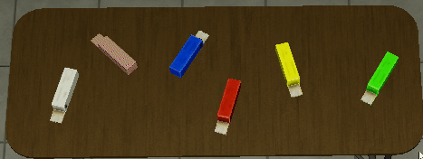

export const Center = ({children}) => (
   

      {children}
   

)

export const TextColor = ({children, color}) => (

{children}

);

 

:::info
Testing Clearance: <TextColor color="#735cff">**Junior Researcher**</TextColor>  
Cross-Testing Clearance: <TextColor color="#735cff">**Junior Researcher**</TextColor>  
Maximum Class-D Allowed: <TextColor color="#FF6A00">**7**</TextColor>  
Location: <TextColor color="#3161c1">**ScD Cleanrooms - Chamber 06**</TextColor>  
:::

 

**SCP 1200 also known as “Tastes Like Chewing Gum”** is composed of 6 known packages of anomalous gums, that if consumed, give a subject certain anomalous properties related to their name (for instance, the gum “Tastes like ghost” makes its consumer translucent, just like a ghost). These gums cannot be “carried” and are to be clicked while they lie on the table they are currently placed. As of now, no gums seem to kill/harm their consumer.

SCP-1200-58 "Tastes like Change" [ White Gum ]

SCP-1200-58, also known as "Tastes like Change" is a harmless instance of SCP-1200. When consumed, the subject will grow and change in height, weight, shape, and form. Noted transformations include subjects becoming taller, skinny, buffer, heavier, and lighter. These effects do not damage the subject, and no other anomalous changes seem to take place.

SCP-1200-29 "Tastes like Rubik's Cube" [ Rainbow Gum ]

SCP 1200-29, also known as “Tastes like Rubik's Cube” is another harmless instance of 1200. If consumed, the subject will shrink and its body will deform into bizarre proportions. These effects do not damage the subject and no other physical changes aside from deformation seem to take place.

SCP-1200-30 "Tastes like Shadows" [ Blue Gum ]

SCP-1200-30, also known as "Tastes like Shadows" will created what appear to be translucent clones of the consumer. They will assume a wedge position, and seem to follow the consumer around. They appear to have similar effects like SCP-1200-46 "Tastes like Ghost". The subject will not be harmed or injured in any way, and the clones will disappear when the subject has died or been terminated.

SCP-1200-46 "Tastes like Ghost" [ Red Gum ]

The red instance of SCP 1200 makes anyone who consumes it somewhat translucent (although to a point where the naked eye can see said subject). The effects don’t seem to wear down nor to damage the subject under the effects of said gum.

SCP-1200-15 "Tastes like Sunshine" [ Yellow Gum ]

The yellow gum is another instance of SCP 1200. Subjects who consume it start to emit intense white light, almost to a degree where the subject itself cannot be seen by other people staring at him. The gum’s effects seem to wear down if the red gum is consumed afterwards and do not damage the consumer.

SCP-1200-12 "Tastes like Blindness" [ Green Gum ]

When consumed, SCP-1200-12 will slightly blind the consumer with bright colors and light. No physical changes appear to occur, and no injuries or emotional changes occur either. In a sense, SCP-1200-12 is the opposite of SCP-1200-15. No other effects have been recorded or discovered.

