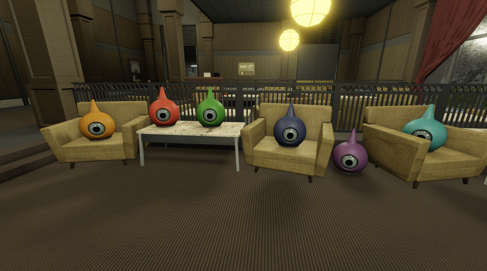
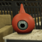

export const Center = ({children}) => (
   <div
      style={{
         "textAlign": "center"
      }}>
      {children}
   </div>
)

export const TextColor = ({children, color}) => (
<span
style={{
      color: color,
    }}>
{children}
</span>
);

<div style={{textAlign: 'center'}}>




</div>
<Center>SCP-131 instances in the SL-4 Lobby relaxing</Center>

<br />

:::info
Testing Clearance: <TextColor color="#735cff">**Assistant Researcher**</TextColor> <br />
Cross-Testing Clearance: <TextColor color="#735cff">**Assistant Researcher**</TextColor> <br />
Maximum Class-D Allowed: <TextColor color="#FF6A00">**7**</TextColor> <br />
Location: <TextColor color="#3161c1">**ScD Cleanrooms - Chamber 04**</TextColor> <br />
:::

<br/>

**SCP-131, also known as “The Eyepods”** are a group of anomalies, all of them with different personalities and colors. They have a singular eye, and do not have to blink. Their eyes have been discovered to emit a low intensity light. They use this light for different reason, such as alerting Personnel, or to communicate. They are only capable of answering <TextColor color="#3161c1">`yes` or `no` questions</TextColor>. They are better with simple speech and have trouble with more difficult phrases and words. Each instance has a different personality and form different connections with Personnel. Some instances seem to bond with humans more easily and these bonds may reach a point where SCP-131 feels empathy for said person or grief if he/she dies, thus it is not recommended to terminate CDs who bonded with SCP-131 when these same anomalies are nearby. For more information on each SCP, you may refer to the section below.

<details>

<summary>SCP-131-R | Red</summary>



Red can be Classified as a Leader for the Eyepods, it seems to have power over its compliances. Although it wouldn’t be described as playful it will interact with Personnel once in sight, other instances tend to assist Red, or follow it.

</details>

<details>

<summary>SCP-131-O | Orange</summary>


The orange instance of SCP 131 is out of all instances the most playful, this makes it the easiest instance to bond with (usually with compliments and playing), however, this comes at the cost of it sometimes struggling on certain tasks given by FP. Unlike the Purple instance, it seeks no harm with its playing and doesn’t seem to try to trick FP. It's rather hyperactive nature can cause it to flee from certain situations.

</details>

<details>

<summary>SCP-131-C | Cyan</summary>


SCP-131-C can be described as an extroverted, overly friendly instance. While it is cautious of those in authority, it bonds rather quickly to those who enter its containment chamber, and seems to take to Class D much better than individuals merely observing it. It's incredibly caring, empathetic ability rivals every one of the other SCP-131 instances, and one may wonder whether it prioritizes the health and safety of others over its own.

</details>

<details>

<summary>SCP-131-DB | Denim/Dark Blue</summary>


The Dark blue instance of SCP-131 shows some common behavior aspects with the orange instance, the difference being that dark blue is more reserved and curious regarding anomalies and new experiences. It will often interact with FP (by standing on someone's shoulders for instance) and, if bonded, it will be cooperative with one’s requests.

</details>

<details>

<summary>SCP-131-B | Black</summary>

```
$ SCPF_NETWORK/PARAGON/DATABASE/SCP-131-B
$ RESULT :: [ INFORMATION REDACTED BY O5 COUNCIL ] 
```

</details>

<details>

<summary>SCP-131-P | Purple</summary>


The purple instance of SCP 131 has shown to be the most “problematic” of all instances. It constantly tricks FP into traps and seems to find joy in doing so, thus making it somewhat hard to cooperate. As of yet, it hasn't commit any physical harm to FP. It is recommended one to be cautious when SCP-131-P is nearby.

</details>

<details>

<summary>SCP-131-G | Green</summary>


The Green instance of SCP-131 is the shyest of the 131 instances, it is friendly towards Foundation Personnel, but has a tendency to run away, or hide from them. When put into a dangerous situation, 131-G will usually flee as soon as possible, if it is unable to flee it may hide behind or under any solid object.

</details>
