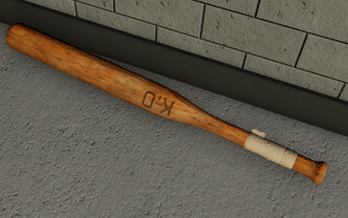

export const Center = ({children}) => (
   

      {children}
   

)

export const TextColor = ({children, color}) => (

{children}

);

SCP-2398

 

:::info
Testing Clearance: <TextColor color="#735cff">**Junior Researcher**</TextColor>  
Cross-Testing Clearance: <TextColor color="#735cff">**Junior Researcher**</TextColor>  
Maximum Class-D Allowed: <TextColor color="#FF6A00">**3**</TextColor>  
Location: <TextColor color="#3161c1">**ScD Cleanrooms - Chamber 07**</TextColor>  
:::

 

**SCP-2398 also known as "A Really Good Bat"**, is a plain wooden baseball bat measuring roughly 1 meter in length, with a taped grip. The bat does not display any anomalous effects when not in use. SCP-2398 when used to hit another person will produce an explosion causing the victim to die immediately. However there have been cases when Personnel have survived by avoiding a direct hit, and taking the hit to the arm or leg. The explosion has an area of effect, and will do some damage to members who get caught in the explosion.
