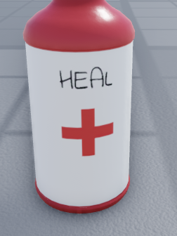

export const Center = ({children}) => (
   

      {children}
   

)

export const TextColor = ({children, color}) => (

{children}

);

SCP-500 Bottle

 

:::info
Testing Clearance: <TextColor color="#735cff">**Assistant Researcher**</TextColor>  
Cross-Testing Clearance: <TextColor color="#735cff">**Assistant Researcher**</TextColor>  
Maximum Class-D Allowed: <TextColor color="#FF6A00">**7**</TextColor>  
Location: <TextColor color="#3161c1">**ScD Cleanrooms**</TextColor>  
:::

 

**SCP-500, also known as "Panacea"**, is a round white label tightly encircles the red glass bottle in which SCP-500 appears. Unique handwriting appears on the white label reading "HEAL.". Directly beneath that, printed into the seal, is a red cross symbol. Inside the bottle counts forty-seven red pills. SCP 500's only way to afflict an individual is through the consumption of pills inside.

Effects of consumption that have been so far documented are,&#x20;

- Cures the host of any known illness they are afflicted with;
- Cures the host of any current mental conditions they are afflicted with;
- Completely removes pain felt by the user;
- Cures the host of any current physical conditions.

There are currently no documented side effects from SCP-500 as well as it seems impossible to overdose on SCP-500-1.
