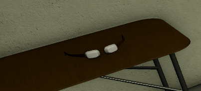

export const Center = ({children}) => (
   

      {children}
   

)

export const TextColor = ({children, color}) => (

{children}

);

SCP-9883 "Ordinary Spectacles"

 

:::info
Testing Clearance: <TextColor color="#735cff">**Assistant Researcher**</TextColor>  
Cross-Testing Clearance: <TextColor color="#735cff">**Assistant Researcher**</TextColor>  
Maximum Class-D Allowed: <TextColor color="#FF6A00">**5**</TextColor>  
Location: <TextColor color="#3161c1">**ScD Cleanrooms**</TextColor>  
:::

 

**SCP-9883, also known as "Ordinary Spectacles"**, is a standard pair of glasses that have a physical resemblance similar to those from the 1800's. It shows no anomalous properties when not being held, and are stored with plastic covers over the lenses. When held, subjects have been reported to undergo drastic proportional changes to their body. This may range from decreasing or increasing in height, and losing or gaining weight. Subjects reported not feeling any pain when undergoing said physical changes, and effects are said to wear off when the SCP is removed from the subject's body. When the glasses are removed mid transformation, the subject will remain in their current physical state.